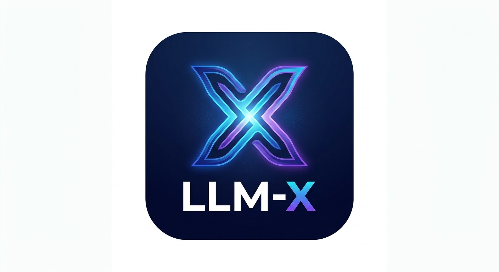

<p align="center">
  
</p>

<h1 align="center">LLM-x</h1>

## 💻 Tech Stack & Infrastructure

### Core Programming Languages, Core Systems
[](https://www.python.org/)
[](https://www.rust-lang.org/)
[](https://isocpp.org/)
[](https://www.typescriptlang.org/)
[](https://www.kernel.org/)
[](https://ubuntu.com/)

### Platform Support & Hardware Architecture
[](https://developer.nvidia.com/cuda-zone)
[](https://developer.apple.com/metal/)
[](https://www.amd.com/en/graphics/servers-solutions-rocm)
[](https://www.arm.com/)
[](https://webassembly.org/)

### Low-Level Infrastructure & Performance
[](https://kafka.apache.org/)
[](https://redis.io/)
[](https://grpc.io/)
[](https://nginx.org/)
[](https://www.ray.io/)

### Cybersecurity & Offensive Auditing
[](https://owasp.org/)
[](https://www.kali.org/)
[](https://www.wireshark.org/)
[](https://www.sonarsource.com/)
[](https://snyk.io/)

### DevOps & Build Tools
[](https://www.docker.com/)
[](https://kubernetes.io/)
[](https://github.com/features/actions)
[](https://www.terraform.io/)
[](https://prometheus.io/)

### Artificial Intelligence & Quantum
[](https://pytorch.org/)
[](https://huggingface.co/)
[](https://www.langchain.com/)
[](https://www.pinecone.io/)
[](https://qiskit.org/)
[](https://openai.com/)

### Cloud Providers
[](https://aws.amazon.com/)
[](https://cloud.google.com/)
[](https://azure.microsoft.com/)
[](https://www.cloudflare.com/)


**LLM-x is a decentralized, fault-tolerant multi-agent infrastructure designed to replace monolithic models with a specialized swarm of 10 micro-competencies. It features an automated DPO self-correction flywheel and multi-transport network bonding for zero-downtime execution resilience.**

## ❓ What is this about?
Instead of using one giant, bulky AI brain to do everything, LLM-x uses a team of 10 smaller, super-smart mini-brains. Each mini-brain has a specific job it is really good at!

## 🛠️ What this does?
It takes big, complicated tasks and hands them out to the right mini-brain. If one mini-brain gets confused, the others help fix it. It also makes sure the whole system stays online, even if the internet connection gets bumpy, by using multiple paths at the same time.

## ⚙️ How this works?
It runs on a mix of three fast languages: **Rust**, **Go**, and **Python**. 
* The **Rust** part acts like the strong core and handles the tough network bonding (making sure the connection doesn't drop).
* The **Go** part acts like a traffic cop, safely directing all the messages in the gateway.
* The **Python** part runs the actual mini-brains (agents) and a special "flywheel" pipeline that helps them learn from their mistakes automatically.

## 😎 Why is this cool?
It fixes its own mistakes without a human needing to step in! Plus, it is built to be nearly impossible to knock offline. Even if one part breaks, the rest of the team keeps moving forward.

## 🧯 What problems this solves?
Big, single AI models can be slow, expensive to run, and if they crash, the whole system stops. They also tend to confidently make mistakes without noticing. LLM-x solves this by splitting up the work, double-checking answers automatically, and guaranteeing the system stays awake and active. 

## 💻 How to install this?
Since LLM-x uses multiple tools, you will need Rust, Go, and Python 3.11 installed on your computer.

1. **Get the code:**
```bash
git clone [https://github.com/darnellwashingtonjr94-art/LLM-x.git](https://github.com/darnellwashingtonjr94-art/LLM-x.git)
cd LLM-x
